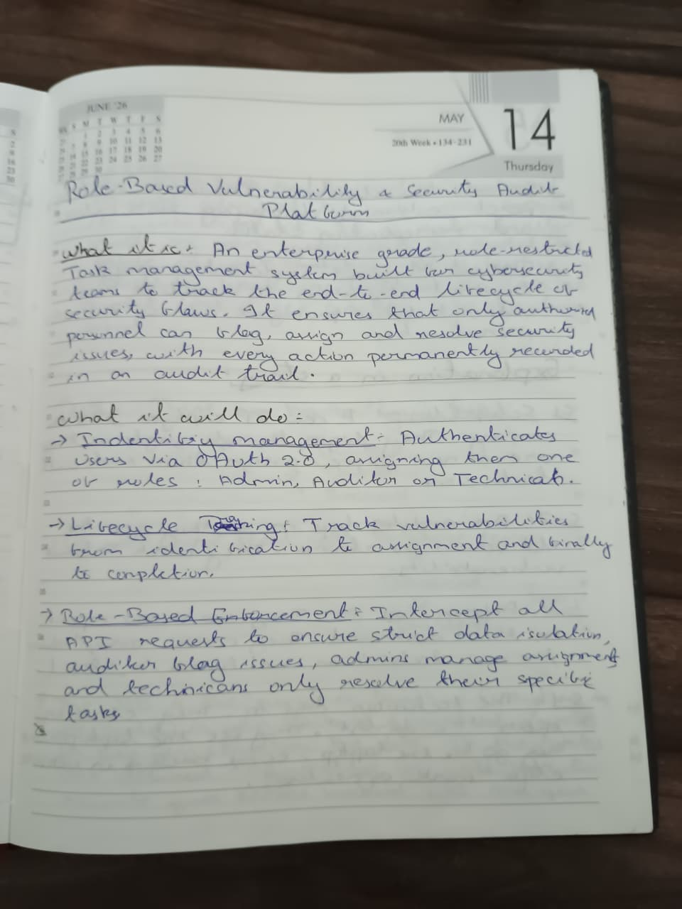
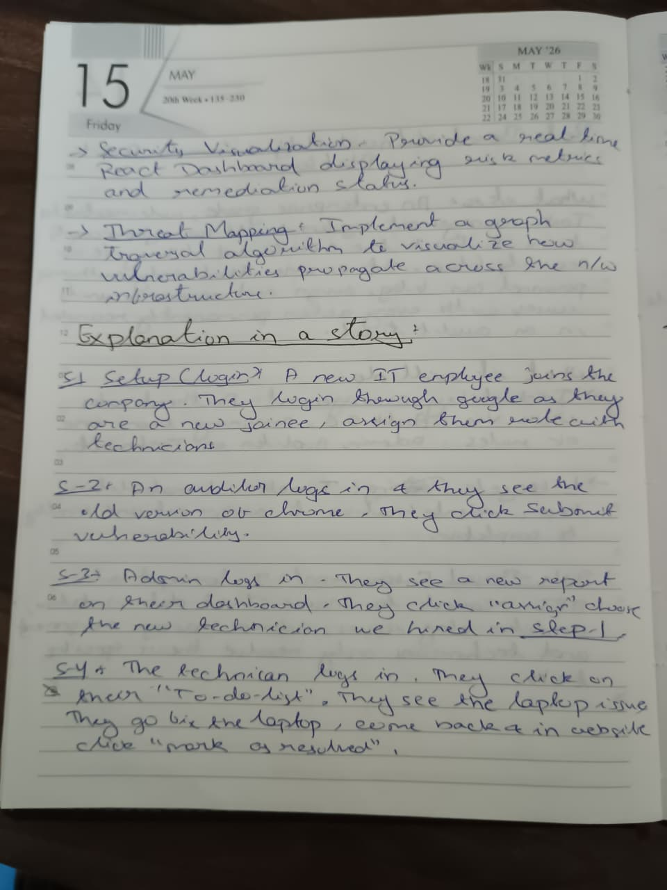
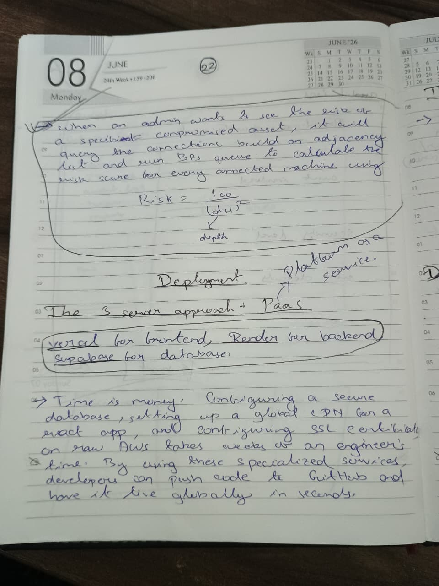
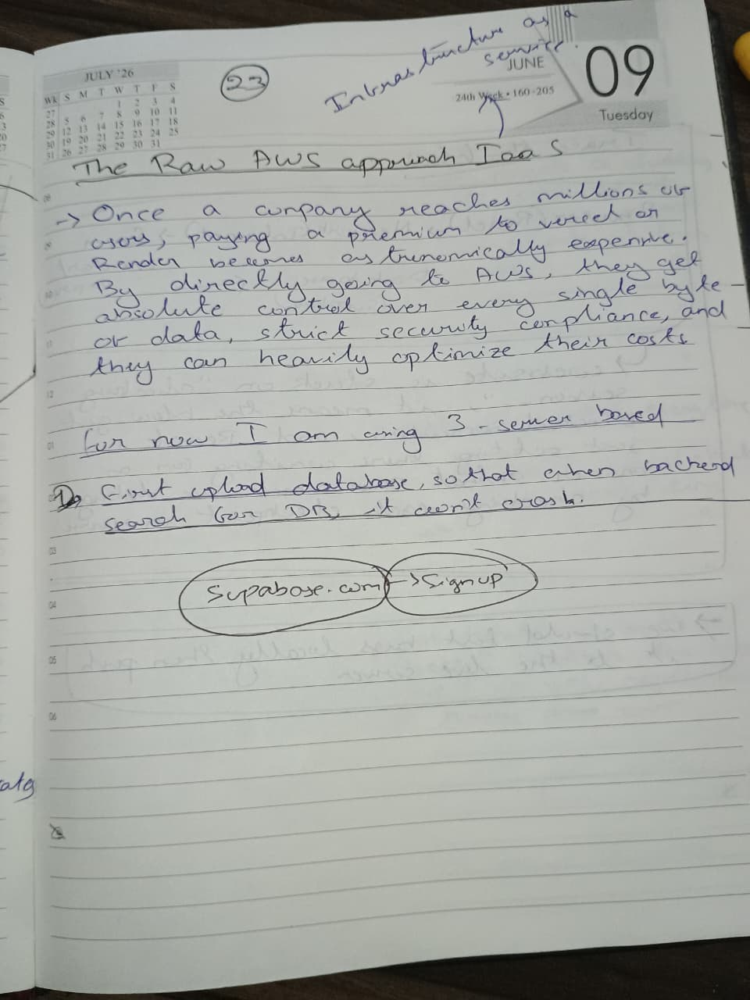
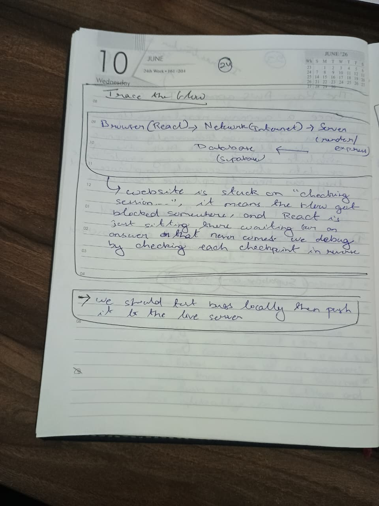

# System Architecture & Development

This section outlines the high-level architecture of the Enterprise Security Audit Platform. It covers the core user stories, the 3-server development strategy (Vercel for the frontend, Render for backend, and supabase for the database), and the debugging flow. 

## Architectural Notes

