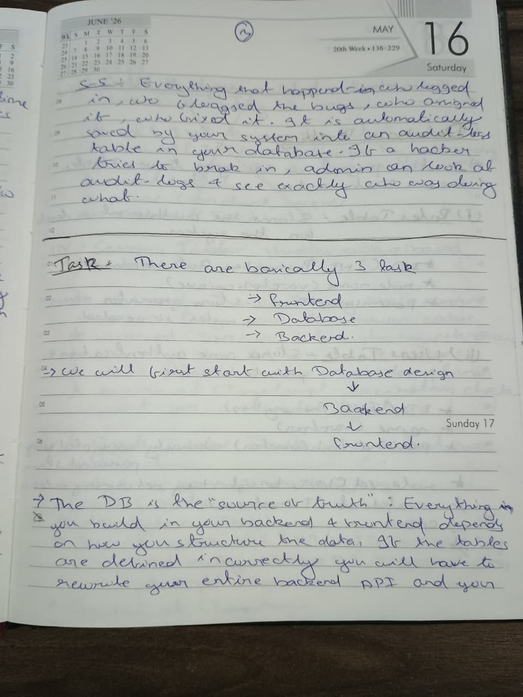
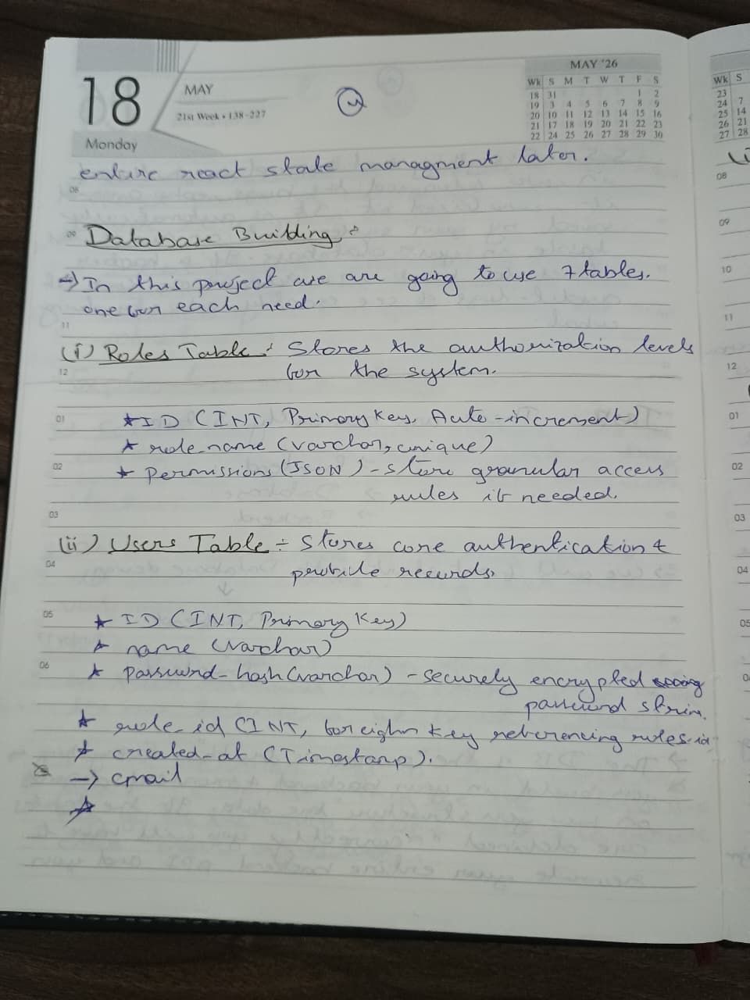
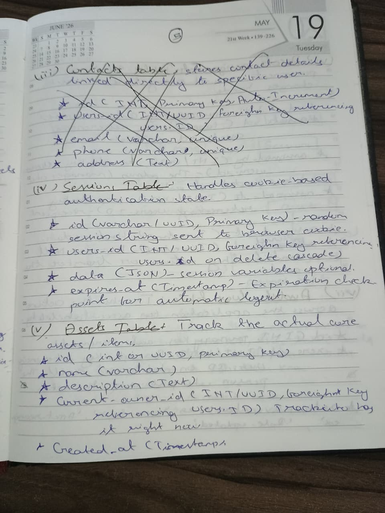
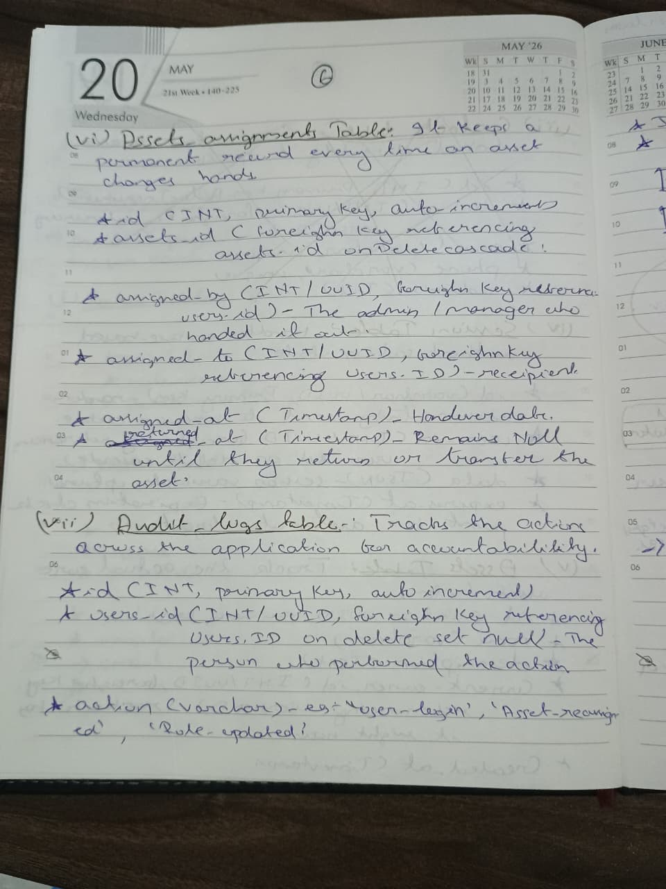
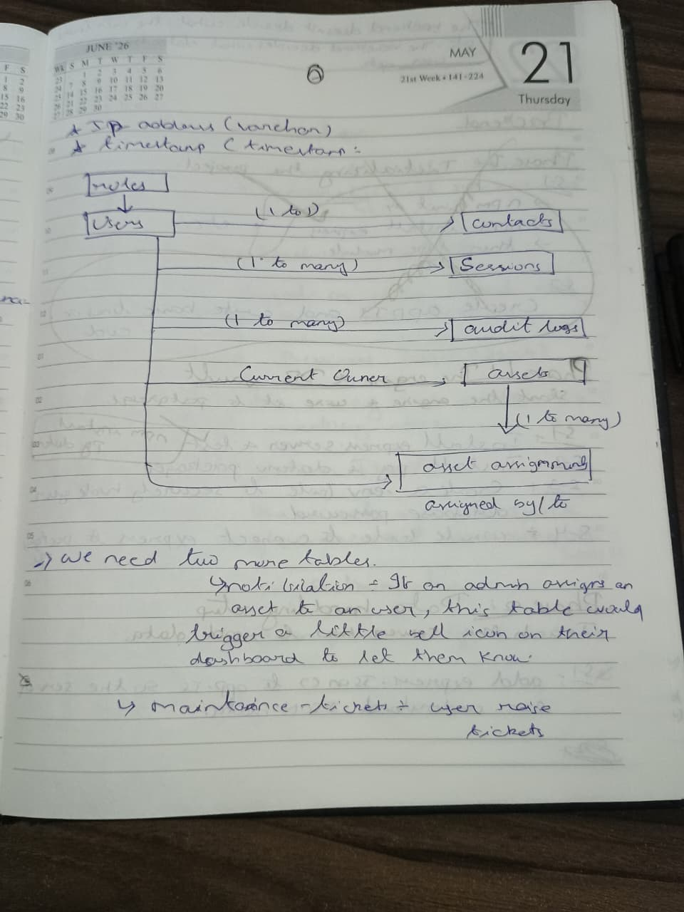

# Database Schema Design

The PostgreSQl database acts as the single source of truth for this application. If the tables are defined incorrectly, the entire backend API fails. 

The section details the 7 primary tables required to manage this system: Roles, Users, Sessions, Assets, Asset_assignments, Audit_logs, Network_connections. It includes the foreign key relationships required to maintain strict accountability. 

## Schema Blueprints

