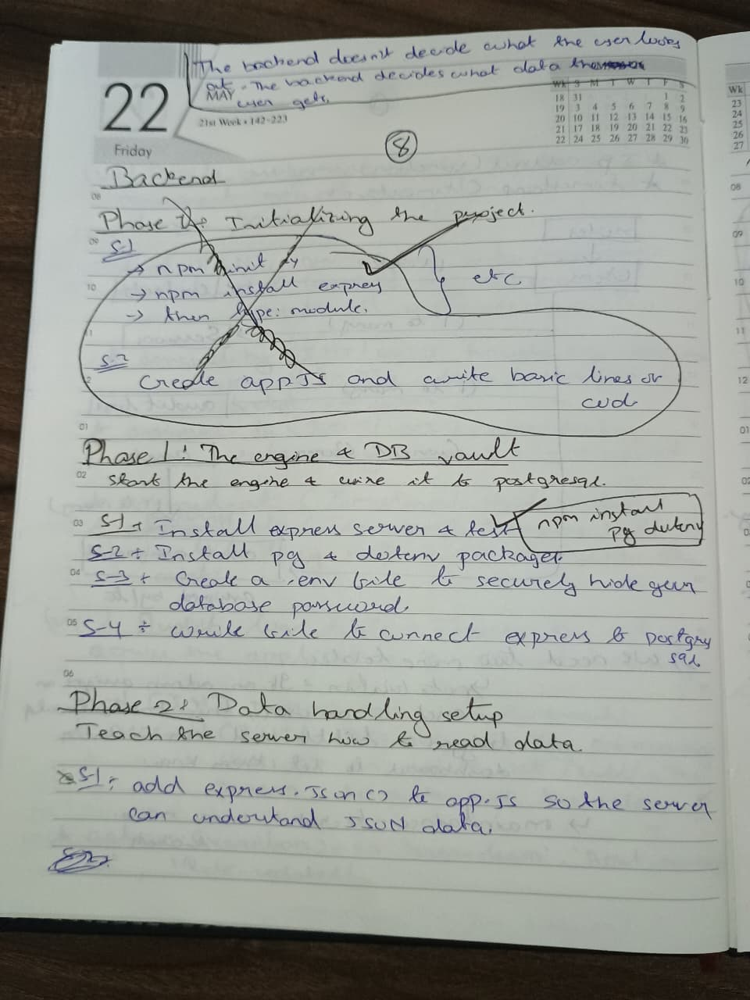
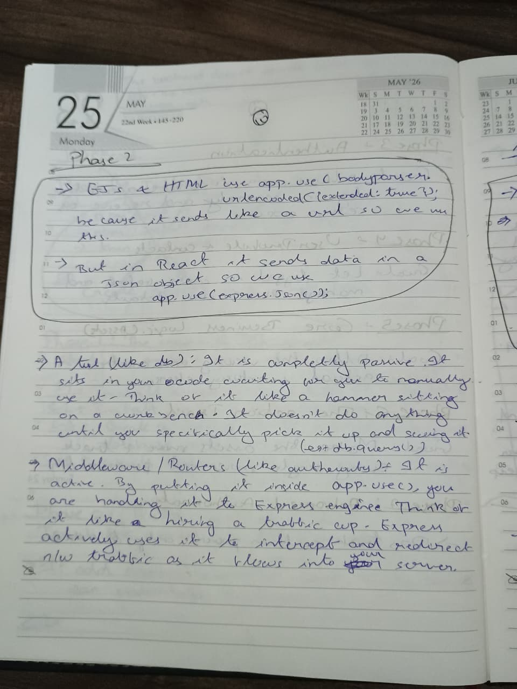
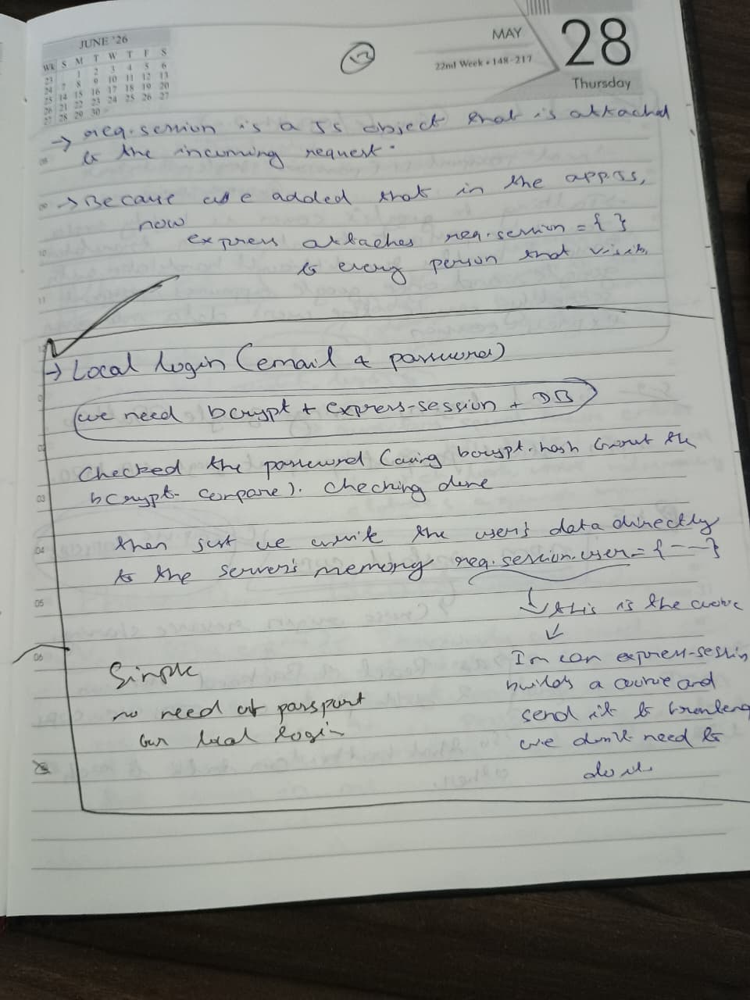
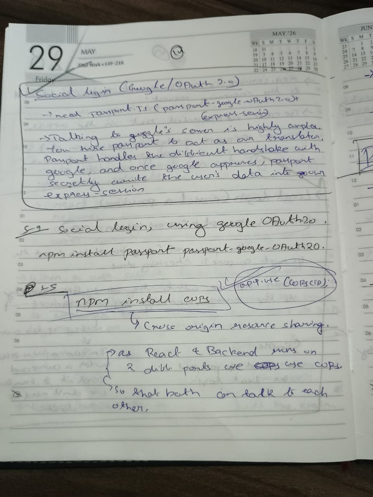

# Backend API & Security Routing

The backend is an Express/Node.js server that acts as a strict gateway between the React frontend and the PostgreSQL database. 

These notes document the initialisation of the server, the REST API phases, middleware configurations for handling JSON, Cross-Origin Sharing(CORS), and the integration of Google OAuth for secure identity management.

## Backend Implementation Notes

