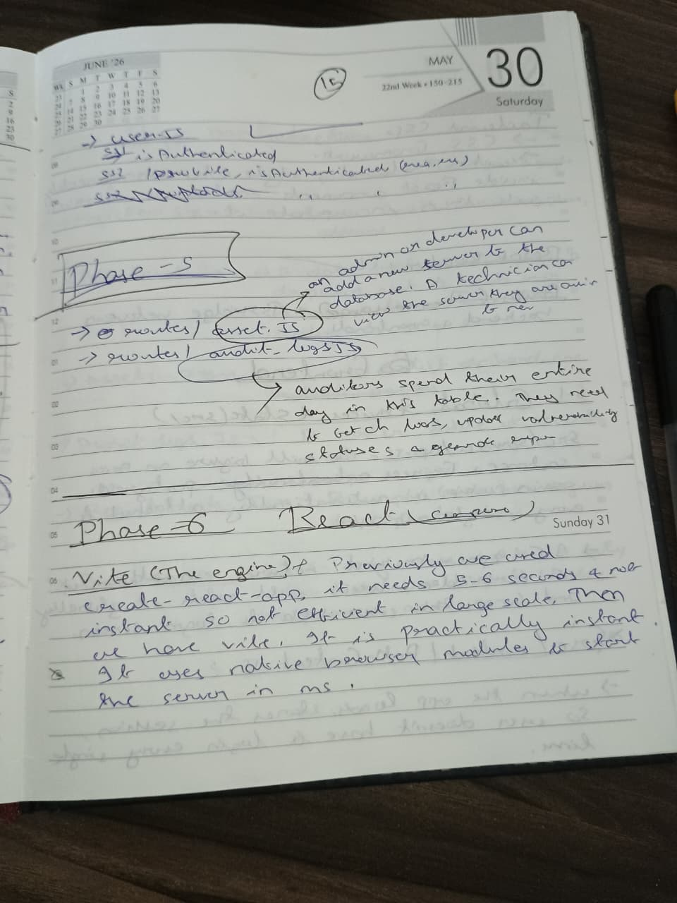
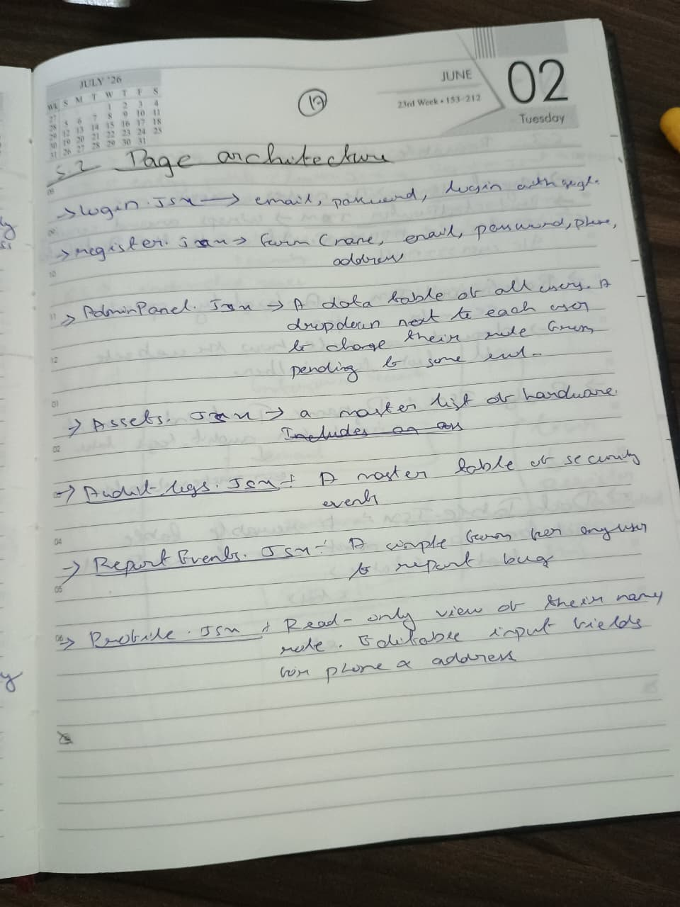
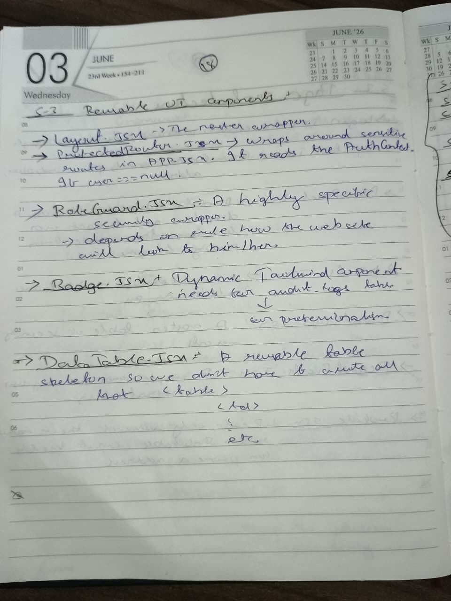
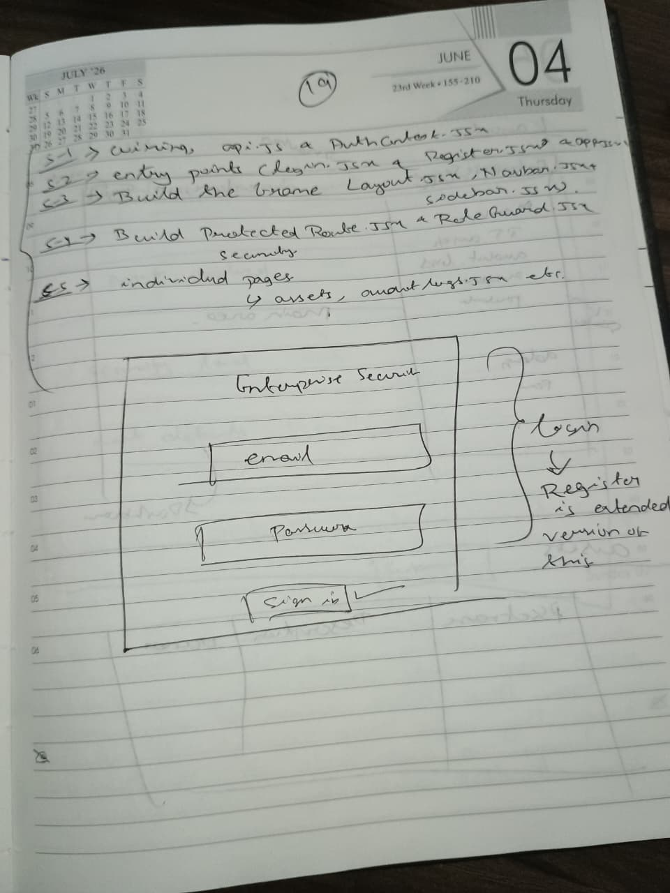
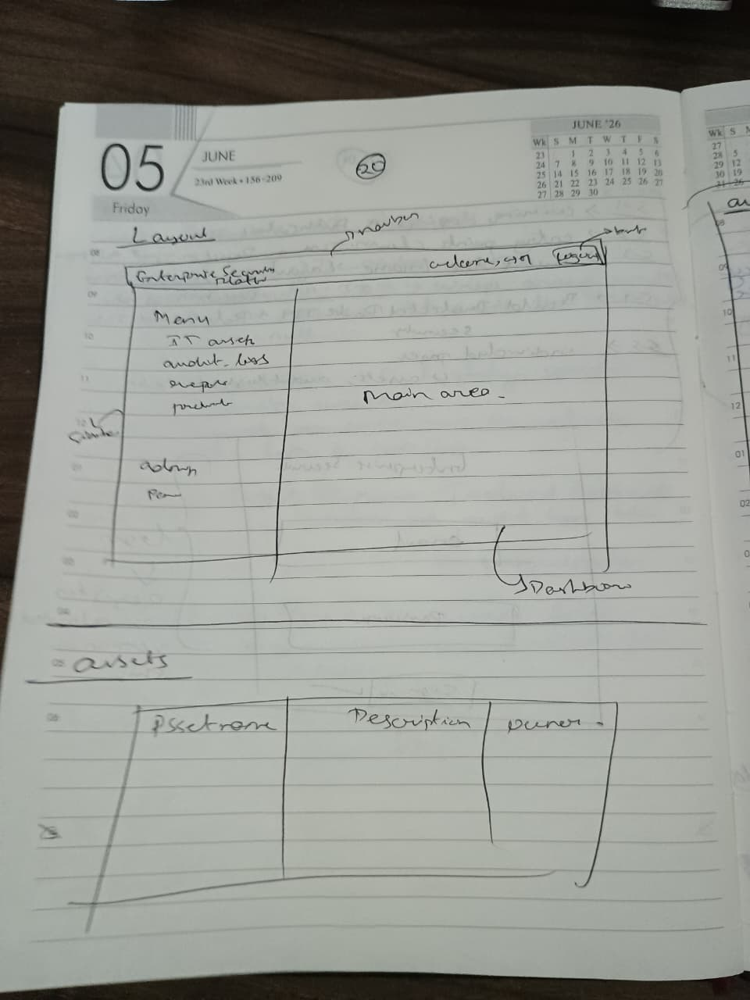
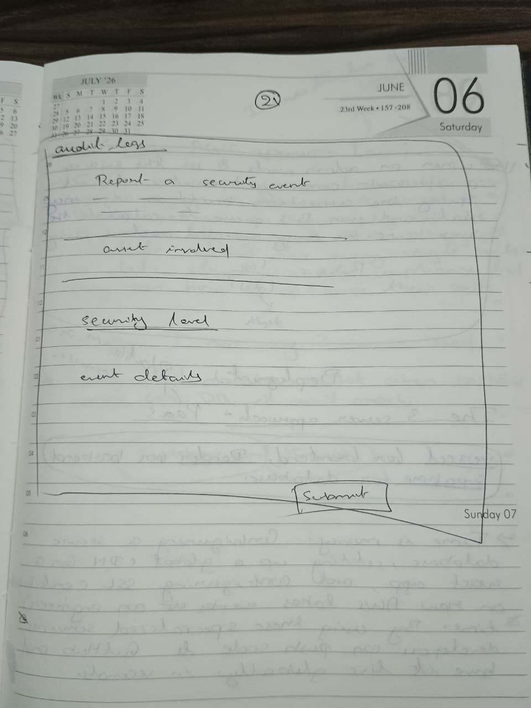

# Frontend UI & Component Architecture

The frontend is built with React (via Vite) for near-instant module loading and styled with Tailwind CSS for dynamic, responseive design.

This section covers the global state management (Context API), Axios configurations for secure credential transmission, routing logic, and the initial wireframe sketches for the dashboard layout.

## UI & State Management Notes

 