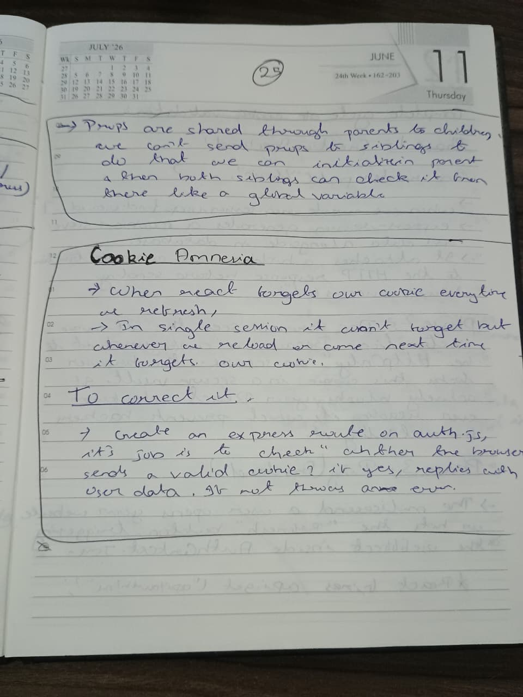
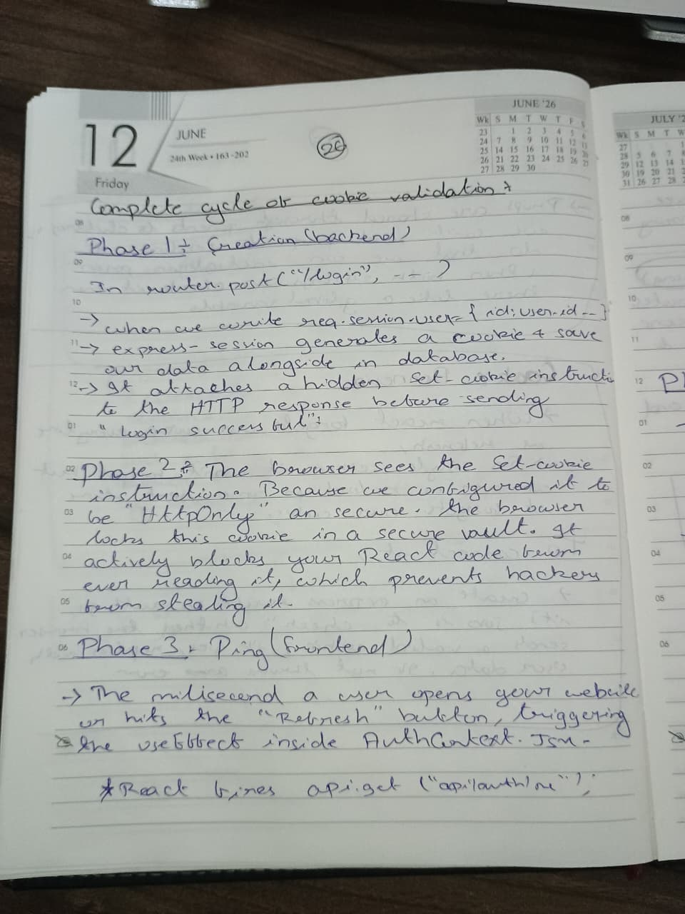
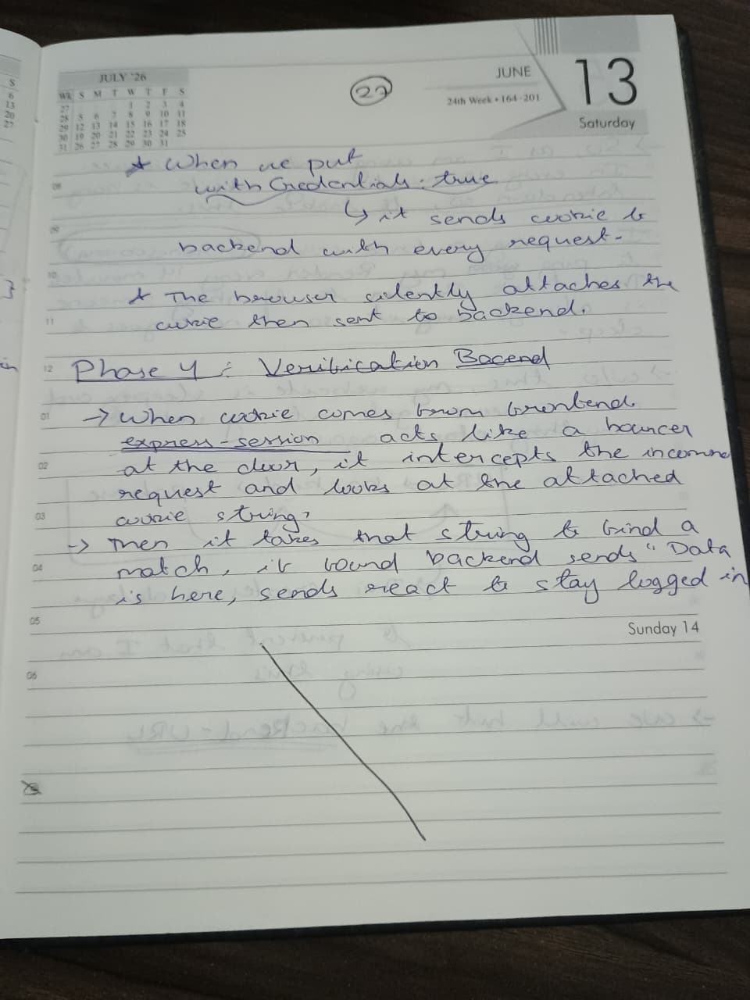
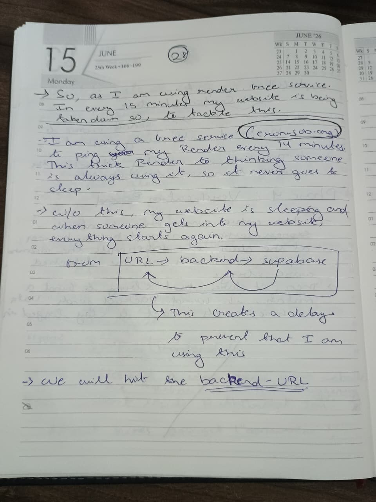

# Authentication Lifecycle & Session Management

Managing state between a stateless HTTP protocol and a dynamic Reat application requires a robust authentication lifecycle.

These notes detail the complete cycle of cookie validation, solving "React State Amnesia" on page reloads, and the implementation of an automated keep-alive ping to prevent the backned server from entering sleep mode on a Paas free tier. 

## Auth Lifecycle Notes

